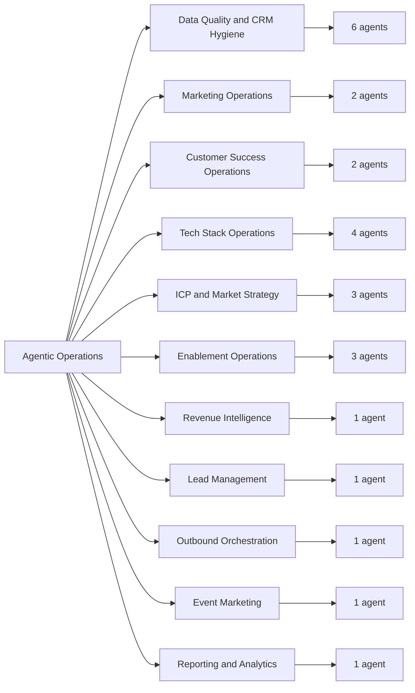
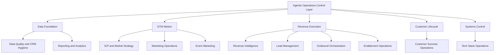

# Agentic Operations

Agentic Operations is a revenue operations control layer.

In plain English: this is the operating map for a modular agent system that
handles the repetitive, messy, high-leverage work inside a revenue organization.
Each agent owns a specific business function, defines the data it needs, produces
an operational output, and respects clear approval boundaries before changing
live systems.

The operating thesis: revenue operations should behave less like scattered
manual work and more like a controlled system with clear inputs, outputs,
owners, confidence thresholds, and escalation paths.

## What Is In This Repo

- 25 RevOps agent runbooks
- 11 business categories
- operating boundaries for analysis, recommendations, and live-system writes
- category maps that show how the system fits together
- implementation-ready logic for data quality, GTM motion, customer success,
  tech-stack control, and revenue intelligence

## Quick Visual Map

## Operating Layers

## Agent Categories

| Category | What it helps with | Agents |
|---|---:|---:|
| Data Quality and CRM Hygiene | Cleaning and improving CRM data | 6 |
| Marketing Operations | Campaign performance and email health | 2 |
| Customer Success Operations | Retention risk and QBR preparation | 2 |
| Tech Stack Operations | Integrations, permissions, vendors, tool usage | 4 |
| ICP and Market Strategy | Ideal customer profile, segments, market sizing | 3 |
| Enablement Operations | Coaching, certification, onboarding | 3 |
| Revenue Intelligence | Sales call insight extraction | 1 |
| Lead Management | MQL scoring and routing | 1 |
| Outbound Orchestration | ICP-based list building | 1 |
| Event Marketing | Event selection and scoring | 1 |
| Reporting and Analytics | Pipeline and warehouse monitoring | 1 |

## Where To Start

- [Agent Map](docs/agent-map.md) shows the operating map.
- [Repository Structure](docs/repo-structure.md) explains how the folders are organized.
- [Operating Boundaries](docs/operating-boundaries.md) defines what agents can analyze, recommend, and change.

## How To Read An Agent

Each agent usually answers five questions:

1. What business problem does it solve?
2. Who is it for?
3. What data does it need?
4. What should it produce?
5. What should it avoid doing without approval?

The agent files are runbooks. They define trigger language, required inputs,
execution logic, output formats, confidence checks, and escalation rules.

## Status

This repo contains the controlled inspection surface for Agentic Operations:
the runbook layer, category map, and approval model without private customer
data, credentials, or deployment configuration.

## License

MIT License. See [LICENSE](LICENSE).
