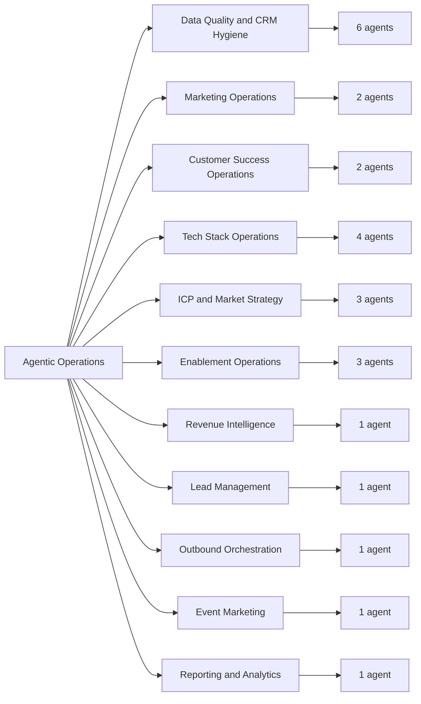

# Agentic Operations

Agentic Operations is a public library of RevOps agent specifications.

In plain English: this repo shows how revenue operations work can be broken into
focused AI agents. Each agent has a clear job, the data it needs, the decisions
it supports, and the guardrails it should follow.

This is designed for interviews, portfolio review, and discussion with operators,
founders, and teams evaluating practical AI workflows.

## What Is In This Repo

- 25 RevOps agent specifications
- 11 business categories
- readable Markdown files instead of hidden packages
- simple maps so non-technical readers can understand the system quickly

## Quick Visual Map

## Agent Categories

| Category | What it helps with | Agents |
|---|---:|---:|
| Data Quality and CRM Hygiene | Cleaning and improving CRM data | 6 |
| Marketing Operations | Campaign performance and email health | 2 |
| Customer Success Operations | Retention risk and QBR preparation | 2 |
| Tech Stack Operations | Integrations, permissions, vendors, tool usage | 4 |
| ICP and Market Strategy | Ideal customer profile, segments, market sizing | 3 |
| Enablement Operations | Coaching, certification, onboarding | 3 |
| Revenue Intelligence | Sales call insight extraction | 1 |
| Lead Management | MQL scoring and routing | 1 |
| Outbound Orchestration | ICP-based list building | 1 |
| Event Marketing | Event selection and scoring | 1 |
| Reporting and Analytics | Pipeline and warehouse monitoring | 1 |

## Where To Start

- [Agent Map](docs/agent-map.md) gives a plain-English inventory.
- [Repository Structure](docs/repo-structure.md) explains how the folders are organized.
- [Public Sharing Notes](docs/public-sharing-notes.md) explains the boundary of what this repo is and is not.

## How To Read An Agent

Each agent usually answers five questions:

1. What business problem does it solve?
2. Who is it for?
3. What data does it need?
4. What should it produce?
5. What should it avoid doing without approval?

The files are written as specifications. They are meant to show operating logic,
workflow design, and product thinking. They are not presented as production-ready
software.

## Status

This is an interview-ready draft library. Some agents began as proof-of-concept
packages and have been unpacked into normal folders so they are easier to review.

## License

MIT License. See [LICENSE](LICENSE).
