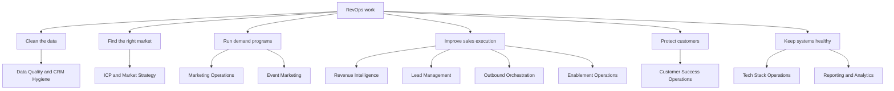

# Agent Map

This page maps the Agentic Operations control layer by business function.

## At A Glance

## Data Quality And CRM Hygiene

These agents protect the data foundation. Bad CRM data creates bad routing, bad
reports, bad forecasts, and wasted sales motion.

| Agent | Plain-English job |
|---|---|
| [Deduplication Engine](../agents/data-quality-crm-hygiene/revops-data-deduplication/SKILL.md) | Finds duplicate contacts, leads, and accounts. |
| [Field Normalization Engine](../agents/data-quality-crm-hygiene/revops-data-field-normalization/SKILL.md) | Standardizes messy job titles, industries, countries, and company names. |
| [Contact Decay Detection](../agents/data-quality-crm-hygiene/revops-data-contact-decay/SKILL.md) | Finds stale contacts that may hurt engagement and sender reputation. |
| [CRM Health Score Agent](../agents/data-quality-crm-hygiene/revops-data-crm-health-score/SKILL.md) | Scores CRM data quality across key dimensions. |
| [Enrichment Orchestration Engine](../agents/data-quality-crm-hygiene/revops-data-enrichment-orchestration/SKILL.md) | Routes missing data to enrichment providers and consolidates results. |
| [Account Hierarchy Engine](../agents/data-quality-crm-hygiene/revops-data-account-hierarchy/SKILL.md) | Maps parent-child account relationships. |

## Marketing Operations

| Agent | Plain-English job |
|---|---|
| [Campaign Performance Agent](../agents/marketing-operations/revops-campaign-performance/SKILL.md) | Pulls campaign metrics into one view and flags waste. |
| [Email Deliverability Agent](../agents/marketing-operations/revops-email-deliverability/SKILL.md) | Monitors sender reputation, authentication, bounces, and spam risk. |

## Customer Success Operations

| Agent | Plain-English job |
|---|---|
| [Customer Retention Risk Agent](../agents/customer-success-operations/revops-customer-retention-risk/SKILL.md) | Reviews separate customer evidence lanes against approved rules without predicting churn or taking action. |
| [QBR Prep Agent](../agents/customer-success-operations/revops-qbr-prep/SKILL.md) | Prepares account review materials from CRM, product, and support signals. |

## Tech Stack Operations

| Agent | Plain-English job |
|---|---|
| [Integration Health Agent](../agents/tech-stack-operations/revops-integration-health/SKILL.md) | Monitors API and system connection health. |
| [Tool Adoption Agent](../agents/tech-stack-operations/revops-tool-adoption/SKILL.md) | Finds underused tools and license waste. |
| [Permission Audit Agent](../agents/tech-stack-operations/revops-permission-audit/SKILL.md) | Flags risky permissions, inactive users, and audit gaps. |
| [Vendor Performance Agent](../agents/tech-stack-operations/revops-vendor-performance/SKILL.md) | Scores vendors by SLA, support, adoption, and renewal risk. |

## ICP And Market Strategy

| Agent | Plain-English job |
|---|---|
| [ICP Development Agent](../agents/icp-market-strategy/revops-icp-development/SKILL.md) | Builds an ideal customer profile from won and lost deals. |
| [Segment Performance Agent](../agents/icp-market-strategy/revops-segment-performance/SKILL.md) | Shows which customer segments are working or drifting. |
| [TAM/SAM Sizing Agent](../agents/icp-market-strategy/revops-tam-sam-sizing/SKILL.md) | Sizes market opportunity from ICP and deal data. |

## Enablement Operations

| Agent | Plain-English job |
|---|---|
| [New Hire Readiness Agent](../agents/enablement-operations/revops-new-hire-readiness/SKILL.md) | Tracks onboarding and ramp progress. |
| [Certification Tracking Agent](../agents/enablement-operations/revops-certification-tracking/SKILL.md) | Tracks required training and escalates overdue certifications. |
| [Coaching Recommendation Agent](../agents/enablement-operations/revops-coaching-recommendation/SKILL.md) | Turns call insights and performance data into coaching recommendations. |

## Pricing And Deal Strategy

| Agent | Plain-English job |
|---|---|
| [CPQ Assist Agent](../agents/pricing-deal-strategy/revops-cpq-assist/SKILL.md) | Reviews exact quote, catalog, pricing-rule, and approval-process evidence without recommending products or taking action. |
| [Competitive Price Evidence Review](../agents/pricing-deal-strategy/revops-competitive-pricing/SKILL.md) | Calculates exact same-basis price differences without recommending prices, discounts, negotiations, alerts, or CRM actions. |

## Capacity And Planning

| Agent | Plain-English job |
|---|---|
| [Territory Scenario Evidence Review](../agents/capacity-planning/revops-territory-design/SKILL.md) | Validates complete territory scenarios without ranking or implementing assignments. |
| [Revenue Capacity Scenario Review](../agents/capacity-planning/revops-revenue-capacity-planning/SKILL.md) | Shows anonymous revenue-capacity scenario arithmetic without making staffing, budget, quota, territory, or worker decisions. |

## Other Focused Agents

| Category | Agent | Plain-English job |
|---|---|---|
| Revenue Intelligence | [Call Analysis Agent](../agents/revenue-intelligence/revops-call-analysis/SKILL.md) | Extracts objections, competitors, next steps, and deal risk from sales calls. |
| Revenue Intelligence | [Competitive Win/Loss Evidence Review](../agents/revenue-intelligence/revops-competitive-winloss/SKILL.md) | Reviews separate source-bound outcome, competitor, reason, interview, annotation, and public-observation evidence without causal or strategic action. |
| Lead Management | [MQL Qualification Agent](../agents/lead-management/revops-mql-qualification/SKILL.md) | Scores and classifies marketing-qualified leads. |
| Outbound Orchestration | [ICP List Building Agent](../agents/outbound-orchestration/revops-icp-list-building/SKILL.md) | Builds prospect lists from ICP criteria. |
| Event Marketing | [Event Selection Agent](../agents/event-marketing/revops-event-selection/SKILL.md) | Scores which events are worth attending or sponsoring. |
| Reporting and Analytics | [ELT Pipeline Monitoring Agent](../agents/reporting-analytics/revops-elt-pipeline-monitoring/SKILL.md) | Watches data pipelines for stale data, failures, and schema drift. |
