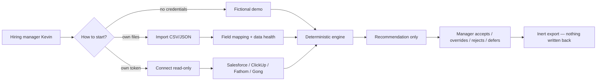
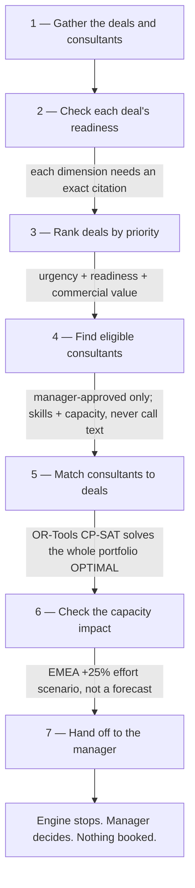
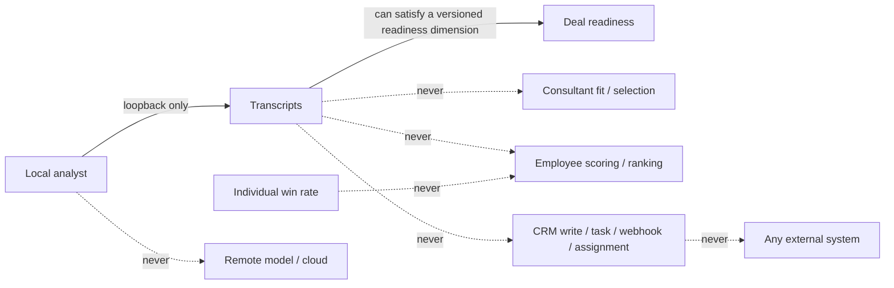

# Presales Deal & Capacity Orchestrator

A local-first, **recommendation-only** prototype that helps a presales / solutions
leader answer three questions from their own data:

1. **Which deals need presales attention first?** (deal prioritization queue)
2. **Which eligible consultant best fits a given deal, and what are the alternatives?** (assignment recommendation)
3. **Where is capacity tight over the next four weeks, and what happens under an EMEA +25% effort assumption?** (capacity heatmap + scenario)

Everything runs on your machine. The demo needs **no account, no API key, no
model, and no network**. The tool never writes back to any system: no CRM
update, no task, no webhook, no message, no assignment, no staffing action.
Outputs are inert recommendations that a manager reviews and disposes of locally.

> **Scope honesty.** This is an evaluation prototype. The vendor adapters
> (Salesforce, ClickUp, Fathom, Gong) are **contract-tested against checked-in
> replay fixtures** with fake credentials — they are not a live vendor
> connection. Every source instance's live-validation proof is
> `NOT_LIVE_VALIDATED`. Production readiness is `NOT_ASSESSED`. See
> [Proof vocabulary](#proof-vocabulary).

## Quick visual map



Three ways in; one engine; the manager decides; nothing is written back.

## How the engine decides (7 stages)



Click **Run the engine** to watch this flow execute live, with each stage's
reasoning narrated as it runs.

## What the engine won't do (boundaries)



- Transcripts can prove a deal's readiness facts; they can never pick or score a consultant.
- No individual win-rate input; no remote model for private transcripts; export is inert.

---

## Quick start (fictional demo — no credentials, no network)

```bash
# 1. install the pinned toolchain and dependencies
uv sync --frozen

# 2. run the full test suite (all offline)
uv run --frozen pytest

# 3. launch the loopback-only review dashboard
./run_demo.command        # macOS double-click, or:
./run_demo.sh             # any POSIX shell
```

Open the printed `http://127.0.0.1:8501` link and click **Run fictional demo**.
The dashboard shows execution mode `FICTIONAL_REPLAY` and analysis mode
`RECORDED_ANALYST_REPLAY`, then renders the prioritized queue, an assignment
recommendation with alternatives, the capacity heatmap, the EMEA +25% effort
scenario (a `USER_SELECTED_ASSUMPTION_NOT_A_FORECAST`, not a forecast), a
fact-bound leadership digest, per-source proof rows, and the conservative run
summary.

If `uv` is not installed: `curl -LsSf https://astral.sh/uv/install.sh | sh`.

---

## For a hiring manager (Kevin): two ways to use this

You can evaluate this tool in minutes with the fictional demo, then try it on
**your own data** without giving it any credentials.

### A. See the demo (fastest)

`./run_demo.sh` → **Run fictional demo**. Nothing to configure. Full walkthrough
in [`docs/recruiter-playbook.md`](docs/recruiter-playbook.md).

### B. Use your own data by file import (no credentials)

```bash
./run_demo.sh --mode import
```

On the single Run-setup screen you: attest that you are authorized and selected
the minimum necessary fields, choose your CSV/JSON export, select fields,
preview, map each source field to a canonical field, reconcile, and accept the
data-health report. A checked-in fictional import sample
(`data/examples/import/`) lets you exercise the whole flow first. Field mappings
are explicit and hash-bound — the tool never invents or silently applies a
mapping. See [`config/mapping_profiles/`](config/mapping_profiles) for
ready-to-adapt sample profiles.

### C. Optional read-only connect (your own authorized token)

```bash
./run_demo.sh --mode connect
```

If you have your own authorized read-only Salesforce / ClickUp / Fathom / Gong
access, you can point an adapter at it. You attest authorization first; no
preflight, schema read, file read, preview, or connector call happens before
that. Credentials stay in process memory only and are never persisted. The
adapters use a GET / read-by-POST allowlist and perform no writes. File import
is always available as the contract-tested fallback. Using a valid authorized
account does **not** by itself change any source's proof label — see
[Proof vocabulary](#proof-vocabulary).

---

## Screenshots

Representative captures of the fictional demo path are in
[`docs/screenshots/`](docs/screenshots):

- `01-landing.png` — the three start paths.
- `02-results-overview.png` — queue, assignment, capacity heatmap, EMEA
  assumption, and digest.
- `03-results-full.png` — full results including per-source proof rows, the
  conservative run summary, manager dispositions, the inert export, and reset.

## What runs, precisely

- **Deterministic core** (Python + Google OR-Tools CP-SAT): readiness lanes,
  priority scoring, eligibility, weekly capacity, assignment optimization with a
  brute-force oracle cross-check, alternatives, capacity heatmap, and the EMEA
  scenario. Deterministic rules and the solver own every decision-bearing value.
- **No individual win-rate input** is used in scoring.
- **Conversation evidence is additive only.** A transcript can satisfy a
  cited, versioned readiness dimension bound to an exact deal crosswalk. It can
  **never** pick or score a consultant, and there is no standalone conversation
  lane and no transcript-derived manager tag. Full transcript text stays in
  process memory only; only a hash, metadata, and cited excerpts can be
  persisted.
- **Read-only, no-write posture** everywhere. Export is inert.

## Repository layout

```
config/    demo policy, connector-security pins, retention profiles, sample mapping profiles
data/      fictional/  (frozen synthetic dataset)  examples/import/  (sample imports)
           replay/     (official-shape fixtures: salesforce, clickup, fathom, gong)
schemas/   generated JSON Schemas for every canonical contract
src/orchestrator/  contracts, ingestion adapters, mapping, deterministic core, llm, ui
tests/     contracts, ingestion, connector_security, mapping, properties, golden,
           solver, llm, ui, packaging, acceptance
scripts/   schema generation, no-write scan, secret/private scan, notices, release verify
evidence/  package-local accepted-receipt registry (no credentials, no private payloads)
```

## Running the tests

```bash
uv run --frozen pytest                 # everything, offline
uv run --frozen pytest tests/acceptance  # end-to-end contract/replay runs
uv run --frozen pytest tests/packaging   # package hygiene, schemas, licenses
```

Non-connector tests need no network. Connector tests use `httpx.MockTransport`
with fake credentials and checked-in replay fixtures — no vendor network is
ever contacted.

## Verifying the package

```bash
uv run --frozen python scripts/verify_release.py   # manifest + hashes + scans + license inventory
uv run --frozen python scripts/secret_private_scan.py
uv run --frozen python scripts/no_write_scan.py
```

`MANIFEST.sha256` records a checksum for every packaged file so a fresh
clone/unzip can be verified for reproducibility.

## Proof vocabulary

This project keeps **execution**, **implementation proof**, and
**live-validation proof** separate, and reports one row per source instance.
Runtime success never promotes proof; there is no strongest-source rule; the run
summary is derived from the **weakest decision-bearing source**.

| Field | Values used here | Meaning |
|---|---|---|
| Execution mode | `FICTIONAL_REPLAY`, `FILE_IMPORT`, `DIRECT_CONNECTOR_ENABLED` | how the run obtained data |
| Implementation proof | `FULLY_IMPLEMENTED_CONTRACT_TESTED` | the adapter/reader is tested against replay/negative/security/no-network fixtures |
| Live-validation proof | `NOT_LIVE_VALIDATED` | no separately authorized, signed/attested account receipt exists |
| Run summary | `WEAKEST_DECISION_BEARING_SOURCE` | the most conservative contributing label controls the run |
| Production readiness | `NOT_ASSESSED` | security/privacy/legal/workforce/ops review is out of v1 scope |

A source gets a live claim only after a separately authorized, version-bound
receipt is signed or attested into `evidence/live-validation/`. That live
validation is a **separately authorized** step and is **not** part of this
package.

## Boundaries (carry through the whole project)

- Credential-free build and package. No live vendor connection, no real
  accounts/credentials/private data, no remote model.
- No remote model route for private transcripts; any future local route is
  loopback-only.
- Read-only: no CRM write, task, webhook, message, assignment, employment, or
  production mutation anywhere.
- No individual win-rate input in scoring.
- Transcripts may satisfy versioned readiness dimensions but never pick or score
  a consultant.
- Full transcript text in memory only; persisted data is hash + metadata +
  cited excerpts only.

## Documents

- [DISCLAIMER.md](DISCLAIMER.md) · [SECURITY.md](SECURITY.md) ·
  [PRIVACY.md](PRIVACY.md) · [THREAT_MODEL.md](THREAT_MODEL.md)
- [THIRD_PARTY_NOTICES.md](THIRD_PARTY_NOTICES.md) — direct + transitive
  license inventory generated from the resolved lock.
- [LICENSE](LICENSE) — MIT, **provisional** pending the owner's explicit
  confirmation before any public release.
- [`docs/recruiter-playbook.md`](docs/recruiter-playbook.md) — how to demo this
  to a hiring manager and how they use their own data.

## License

MIT (**provisional** — see [LICENSE](LICENSE); not final until the repository
owner confirms it prior to any public release).
